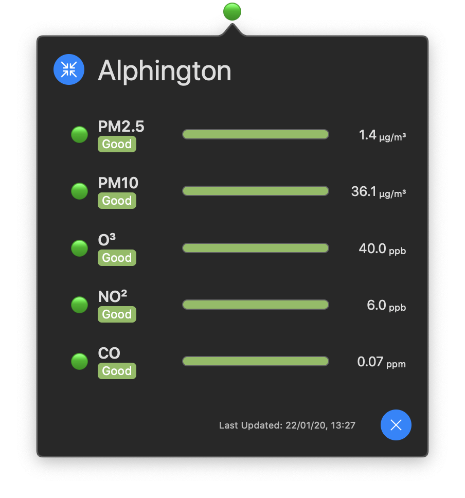
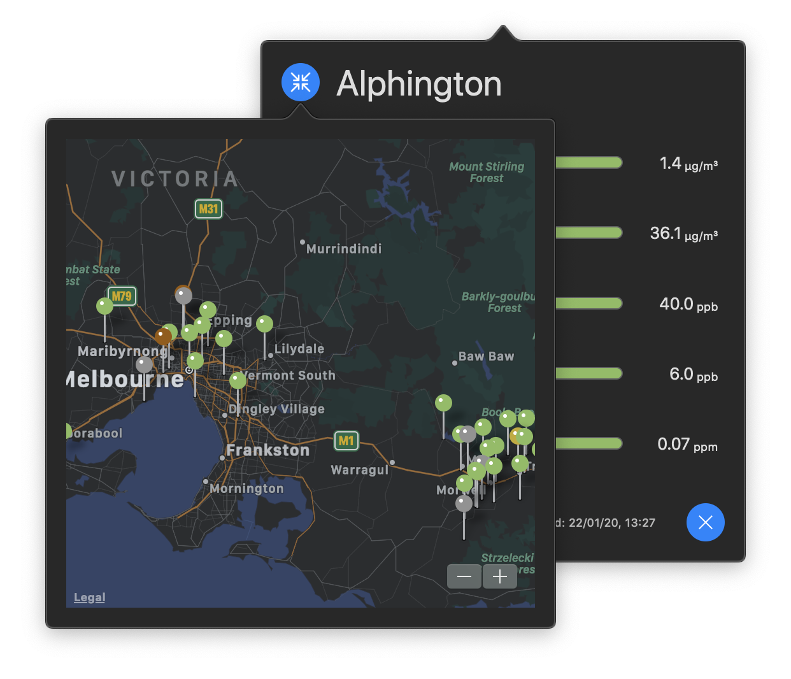

# VicAirQuality  
> MacOS app for checking air quality in the Australian state of Victoria.

A menubar applet that accesses updating air quality information from the Victorian EPA. Presenting both an overview of air quality across the state and detailed information about a particular air quality monitoring site.

## Installation
Just grab the latest release from the releases tab, or build from source following the instructions below.

## Use
VicAirQuality lives in the menubar. When clicked, a pop-up is presented showing detailed information of a particular air quality monitoring site. Clicking the blue crosshair button beside the name of the site presents a map pop-up with an overview of other available air quality monitoring sites. Selecting one of these sites will update the detailed information to that site. Sites in the map pop-up are colour-coded depending on their lowest performing quality. The detailed view adheres to this too, but shows a breakdown of how each quality rates.

## Notes
### Quality Categories
The EPA AirWatch uses five categories to describe the overall air quality at each of their monitoring sites across Victoria.

For each air quality category pollutant measured at a site one of the following grades is applied:

- **Good**: It's a good day to be outside. Denoted by colour green.
- **Moderate**: The air quality is okay, but it could change soon. Denoted by colour yellow.
- **Poor**: The air is probably dusty or smoky. Denoted by colour orange.
- **Very Poor**: The air is probably very dusty or smoky. Denoted by colour red.
- **Hazardous**: The air is probably extremely dusty or smoky. Denoted by colour purple.
- **No Data**: This site is currently not recording any details. Denoted by colour grey.

More information about what these grades mean can be found [here](https://www.epa.vic.gov.au/for-community/monitoring-your-environment/about-epa-airwatch/air-quality-categories). Information about how these grades are calculated by the VIC EPA can be found [here](https://www.epa.vic.gov.au/for-community/monitoring-your-environment/about-epa-airwatch/calculate-air-quality-categories).

## Building
Open the project in Xcode and build. No need to do anything else.

This project was built using SwiftUI with Xcode 11.3.1 under MacOS 10.15.2

## License
`VicAirQuality` is available under a GPLv3 license. See the LICENSE file for more details.

## Disclaimer
### Intended Use of Information
This application provides information about the Victorian EPA and its measurements of air quality in the State of Victoria.

The primary developer is not associated with the Victorian EPA in any capacity. This application's sole function is to provide a convenient way to access air quality information without having to navigate to the Victorian EPA website. 

All the information presented in the application is obtained from the [Victorian EPA API](https://portal.api.epa.vic.gov.au/). The developers of this application rely wholly on the veracity and accuracy of information provided from the Victorian EPA API and do not independently verify any of the information. Electronic communications are always susceptible to fault and as such incorrect data may be presented within the application. There is no guarantee that the information presented in this application is reliable, up-to-date or complete.

The information presented in the application does not take the place of professional or medical advice.

Do not use the information:

- to diagnose, treat, cure or prevent any disease;
- for therapeutic purposes; or
- as a substitute for the advice of a health professional.

The developers that have contributed to the development of this application do not accept any liability for any injury, loss or damage caused by use of the information provided in this application.

The information provided in the application does include the views or recommendations of third parties and does not necessarily reflect the views of its developers, or indicate a recommendation of or commitment to a particular course of action.

### Links to other websites
This documentation contains links to other websites. These are provided to help you find more information. The linked websites do not necessarily reflect the view of the developers of this software.

In the creation of this documentation, care was taken in selecting the websites linked to, but the creators of this documentation are not responsible for and do not necessarily endorse their information. You need to make your own decisions about the accuracy, currency, and reliability of information in linked websites.

### Liability

The developers of this are not liable for any interference with or damage to your computer system, software or data occurring in connection with, or relating to, this application or its use.

You should take appropriate and adequate precautions to prevent damage to your computer system, software or data.